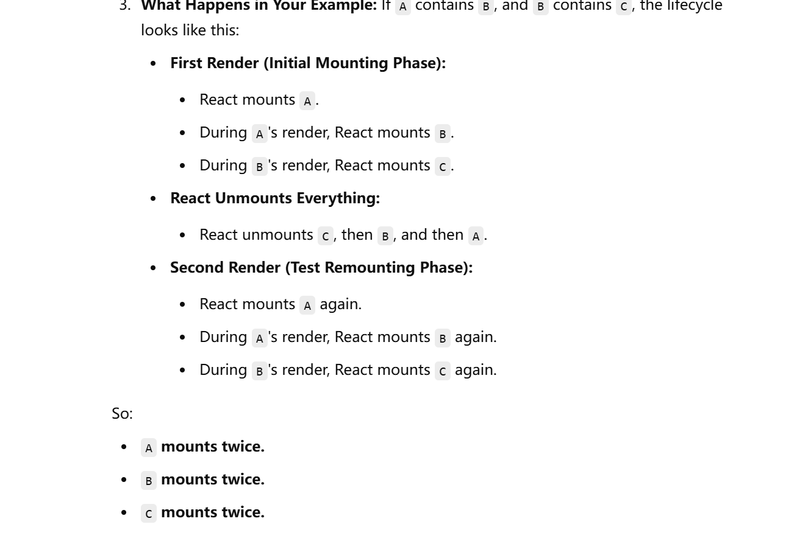

Yes, you should clean up when using `axios`, especially in **React functional components** where you might unmount a component before an `axios` request resolves. Failing to clean up can lead to potential memory leaks or trying to update the state of an unmounted component, which causes React warnings.

---

### Why Cleanup Is Needed in Axios

1. **Prevent Updating State After Unmounting**:
    - If a component unmounts before an `axios` request completes, React will warn you if you attempt to update the state of an unmounted component.

2. **Avoid Memory Leaks**:
    - Keeping unresolved requests active after a component unmounts wastes resources.

---

### How to Clean Up Axios Requests
You can use an **AbortController** or set a flag to cancel an ongoing request.

#### 1. **Using `AbortController` (Recommended)**
The `AbortController` API is a clean and modern way to cancel requests.

```javascript
import { useEffect, useState } from "react";
import axios from "axios";

const MyComponent = () => {
    const [data, setData] = useState(null);
    const [loading, setLoading] = useState(true);
    const [error, setError] = useState(null);

    useEffect(() => {
        const controller = new AbortController(); // Create a new AbortController
        const signal = controller.signal;

        const fetchData = async () => {
            try {
                const response = await axios.get("https://api.example.com/data", {
                    signal, // Pass the signal to axios
                });
                setData(response.data);
            } catch (err) {
                if (axios.isCancel(err)) {
                    console.log("Request canceled:", err.message);
                } else {
                    setError(err);
                }
            } finally {
                setLoading(false);
            }
        };

        fetchData();

        return () => {
            // Cleanup: cancel the request
            controller.abort();
        };
    }, []);

    if (loading) return <p>Loading...</p>;
    if (error) return <p>Error: {error.message}</p>;

    return <div>{JSON.stringify(data)}</div>;
};

export default MyComponent;
```

#### Explanation:
- `AbortController` provides a `signal` that you pass to the `axios` request.
- When the component unmounts, `controller.abort()` cancels the request.

---

#### 2. **Using a Flag**
A simpler approach is to use a flag variable to prevent state updates after unmounting. However, this does not actually cancel the request—it only avoids updating the state.

```javascript
import { useEffect, useState } from "react";
import axios from "axios";

const MyComponent = () => {
    const [data, setData] = useState(null);
    const [loading, setLoading] = useState(true);
    const [error, setError] = useState(null);

    useEffect(() => {
        let isMounted = true; // Set a flag

        const fetchData = async () => {
            try {
                const response = await axios.get("https://api.example.com/data");
                if (isMounted) {
                    setData(response.data);
                }
            } catch (err) {
                if (isMounted) {
                    setError(err);
                }
            } finally {
                if (isMounted) {
                    setLoading(false);
                }
            }
        };

        fetchData();

        return () => {
            // Cleanup: set flag to false
            isMounted = false;
        };
    }, []);

    if (loading) return <p>Loading...</p>;
    if (error) return <p>Error: {error.message}</p>;

    return <div>{JSON.stringify(data)}</div>;
};

export default MyComponent;
```

#### Explanation:
- The `isMounted` flag prevents updating state after the component unmounts.
- However, the request itself is not canceled, meaning it continues to consume resources until completion.

---

### Comparison of Methods
| Approach             | Cancels Request? | Prevents State Update After Unmount? | Complexity |
|----------------------|------------------|--------------------------------------|------------|
| **AbortController**  | ✅               | ✅                                    | Moderate   |
| **Flag Variable**    | ❌               | ✅                                    | Simple     |

---

### Recommendation
- **Use `AbortController`** when possible for a clean solution that both cancels the request and prevents state updates.
- Use the **flag approach** for simpler cases where you don't need to cancel the actual request.

Cleaning up ensures better performance and avoids unnecessary warnings, making your application more robust.


