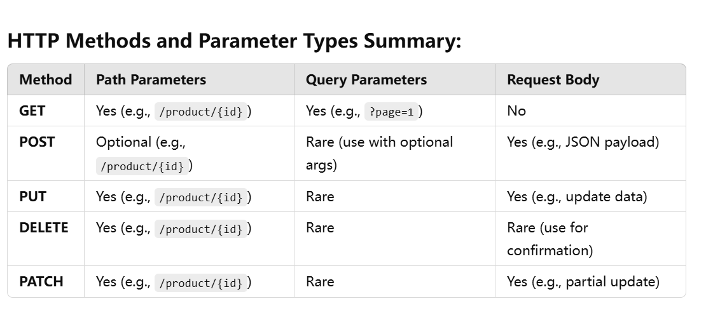

This table summarizes how HTTP methods typically use **path parameters**, **query parameters**, and the **request body** in RESTful APIs. Here's how it applies to a **product management API**, with examples for each method:

---

### **GET**:
- **Path Parameters**:
    - Use path parameters to fetch a specific product by ID.
    - Example: `/product/{id}`
    - Retrieves a specific product's details.
  ```plaintext
  GET /product/123
  ```
  ```java
  @GetMapping("/{id}")
  public ApiResponse<Product> getProductById(@PathVariable("id") int id) {
      return ApiResponse.success(productService.getProductById(id));
  }
  ```

- **Query Parameters**:
    - Use query parameters for pagination, filtering, and sorting.
    - Example: `/product?page=1&size=10&categoryId=2`
    - Retrieves a paginated list of products, filtered by category.
  ```plaintext
  GET /product?page=1&size=10&categoryId=2
  ```
  ```java
  @GetMapping
  public ApiResponse<List<Product>> getProducts(
          @RequestParam("page") int page, 
          @RequestParam("size") int size, 
          @RequestParam(value = "categoryId", required = false) Integer categoryId) {
      return ApiResponse.success(productService.getProducts(page, size, categoryId));
  }
  ```

- **Request Body**:
    - Not used for `GET` methods because data is not sent in the body.

---

### **POST**:
- **Path Parameters**:
    - Rarely used but might specify a parent resource.
    - Example: `/product/{id}/review`
    - Adds a review for the specified product.

- **Query Parameters**:
    - Rarely used but could provide optional arguments.
    - Example: `/product?notify=true`
    - Creates a product and optionally sends a notification.

- **Request Body**:
    - Typically used for sending product data in JSON format.
    - Example: Adding a new product.
  ```plaintext
  POST /product
  Body:
  {
      "name": "Smartphone",
      "price": 299.99,
      "stock": 100,
      "categoryId": 2,
      "description": "A high-quality smartphone",
      "status": "active"
  }
  ```
  ```java
  @PostMapping
  public ApiResponse<String> addProduct(@RequestBody AddProductRequest request) {
      productService.addProduct(request);
      return ApiResponse.success("Product added successfully");
  }
  ```

---

### **PUT**:
- **Path Parameters**:
    - Use path parameters to specify the product to update.
    - Example: `/product/{id}`
    - Updates the product with the given ID.
  ```plaintext
  PUT /product/123
  ```
  ```java
  @PutMapping("/{id}")
  public ApiResponse<String> updateProduct(@PathVariable("id") int id, @RequestBody UpdateProductRequest request) {
      productService.updateProduct(id, request);
      return ApiResponse.success("Product updated successfully");
  }
  ```

- **Query Parameters**:
    - Rarely used for `PUT` methods as updates are typically specific to one resource.

- **Request Body**:
    - Use the body to send updated product details.
    - Example:
  ```plaintext
  {
      "name": "Updated Smartphone",
      "price": 249.99,
      "stock": 50,
      "description": "Updated description",
      "status": "active"
  }
  ```

---

### **DELETE**:
- **Path Parameters**:
    - Use path parameters to specify the product to delete.
    - Example: `/product/{id}`
    - Deletes the product with the given ID.
  ```plaintext
  DELETE /product/123
  ```
  ```java
  @DeleteMapping("/{id}")
  public ApiResponse<String> deleteProduct(@PathVariable("id") int id) {
      productService.deleteProduct(id);
      return ApiResponse.success("Product deleted successfully");
  }
  ```

- **Query Parameters**:
    - Rarely used but might include optional flags.
    - Example: `/product/{id}?softDelete=true`
    - Indicates whether to soft-delete or hard-delete.

- **Request Body**:
    - Rarely used, but could include additional confirmation data for bulk deletions.

---

### **PATCH**:
- **Path Parameters**:
    - Use path parameters to specify the product to partially update.
    - Example: `/product/{id}`
    - Updates specific fields of the product.
  ```plaintext
  PATCH /product/123
  ```

- **Query Parameters**:
    - Rarely used, but could modify the behavior of the patch.
    - Example: `/product/{id}?notify=true`
    - Updates a product and notifies the owner.

- **Request Body**:
    - Use the body to specify the fields to update.
    - Example:
  ```plaintext
  {
      "price": 199.99,
      "stock": 20
  }
  ```
  ```java
  @PatchMapping("/{id}")
  public ApiResponse<String> partiallyUpdateProduct(@PathVariable("id") int id, @RequestBody Map<String, Object> updates) {
      productService.partiallyUpdateProduct(id, updates);
      return ApiResponse.success("Product updated successfully");
  }
  ```

---

### Summary Table with Examples for Products:

| **Method** | **Path Parameters**                     | **Query Parameters**                | **Request Body**                   |
|------------|------------------------------------------|--------------------------------------|-------------------------------------|
| **GET**    | `/product/{id}`                         | `/product?page=1&size=10`           | No                                  |
| **POST**   | `/product/{id}/review` (optional)       | `/product?notify=true` (optional)   | Yes (e.g., product details)         |
| **PUT**    | `/product/{id}`                         | Rare                                | Yes (e.g., full product details)    |
| **DELETE** | `/product/{id}`                         | `/product/{id}?softDelete=true`     | Rare                                |
| **PATCH**  | `/product/{id}`                         | Rare                                | Yes (e.g., partial product details) |

This table aligns with RESTful principles while showing how to handle various product-related API scenarios.