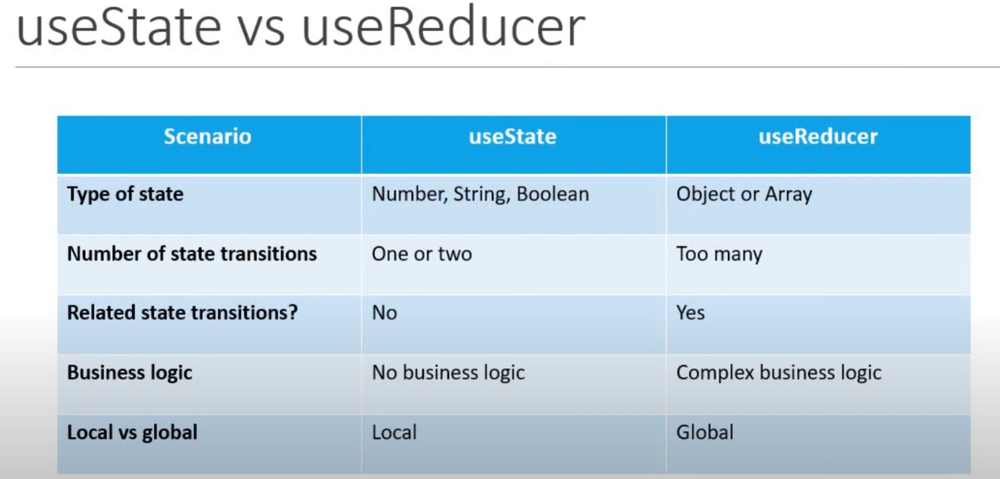

The two methods provided for fetching data use different React hooks for state management:

1. **`useState` with `useEffect`**
2. **`useReducer` with `useEffect`**

Here is a detailed explanation of both approaches and how you can use either based on the complexity of your state.

---

## 1. **Fetching Data Using `useState`**

This approach works well for simple state management. You manage each piece of state individually (e.g., `loading`, `error`, and `data`).

### Code Example:

```javascript
import React, { useState, useEffect } from 'react';
import axios from 'axios';

function DataFetchingOne() {
  const [loading, setLoading] = useState(true);
  const [error, setError] = useState('');
  const [post, setPost] = useState({});

  useEffect(() => {
    axios
      .get('https://jsonplaceholder.typicode.com/posts/1')
      .then((response) => {
        setLoading(false); // Set loading to false
        setPost(response.data); // Set post with the response data
        setError(''); // Clear any previous error
      })
      .catch((error) => {
        setLoading(false); // Set loading to false
        setPost({}); // Clear post data
        setError('Something went wrong!'); // Set error message
      });
  }, []);

  return (
    <div>
      {loading ? 'Loading...' : post.title}
      {error && <p>{error}</p>}
    </div>
  );
}

export default DataFetchingOne;
```

### Key Points:
- **`useState`** is used to create multiple state variables for `loading`, `error`, and `data`.
- The `useEffect` hook performs the data fetching only once when the component mounts (`[]` dependency array).
- The `catch` block handles errors by setting an error state.

### When to Use:
- Use this approach when your state management is straightforward.
- Ideal when you have minimal or independent pieces of state.

---

## 2. **Fetching Data Using `useReducer`**

When the state logic becomes more complex (like combining `loading`, `error`, and `data` into a single state), `useReducer` is a better choice. It centralizes state management into a single reducer function.

### Code Example:

```javascript
import React, { useReducer, useEffect } from 'react';
import axios from 'axios';

const initialState = {
  loading: true,
  error: '',
  post: {},
};

const reducer = (state, action) => {
  switch (action.type) {
    case 'FETCH_SUCCESS':
      return {
        loading: false,
        post: action.payload,
        error: '',
      };
    case 'FETCH_ERROR':
      return {
        loading: false,
        post: {},
        error: 'Something went wrong!',
      };
    default:
      return state;
  }
};

function DataFetchingTwo() {
  const [state, dispatch] = useReducer(reducer, initialState);

  useEffect(() => {
    axios
      .get('https://jsonplaceholder.typicode.com/posts/1')
      .then((response) => {
        dispatch({ type: 'FETCH_SUCCESS', payload: response.data });
      })
      .catch((error) => {
        dispatch({ type: 'FETCH_ERROR' });
      });
  }, []);

  return (
    <div>
      {state.loading ? 'Loading...' : state.post.title}
      {state.error && <p>{state.error}</p>}
    </div>
  );
}

export default DataFetchingTwo;
```

### Key Points:
- **`useReducer`** centralizes the state logic into a single `reducer` function.
- The state transitions (e.g., success or error) are defined using **action types** like `FETCH_SUCCESS` and `FETCH_ERROR`.
- A **dispatch function** is used to trigger state updates by sending actions.
- The `reducer` combines `loading`, `error`, and `post` into a single state object.

### When to Use:
- Use this approach when state transitions are complex or related.
- Ideal when there are multiple state updates, and you want a cleaner, centralized way to manage state.

---

## Comparison Table:

| **Aspect**         | **useState**                            | **useReducer**                          |
|---------------------|----------------------------------------|-----------------------------------------|
| **State management** | Simple and separate state variables   | Centralized state in a single object    |
| **Complexity**      | Good for simple state changes          | Better for complex or related states    |
| **Logic**           | Logic is spread across the component   | Logic is centralized in a reducer       |
| **Readability**     | Easy to read for small components      | More readable when state logic grows    |

---

## Conclusion:
- Use **`useState`** when managing simple or independent state variables.
- Use **`useReducer`** when managing complex state logic where state updates are interrelated.

Both methods work effectively for fetching data, so choose the one that fits your application's needs and complexity.