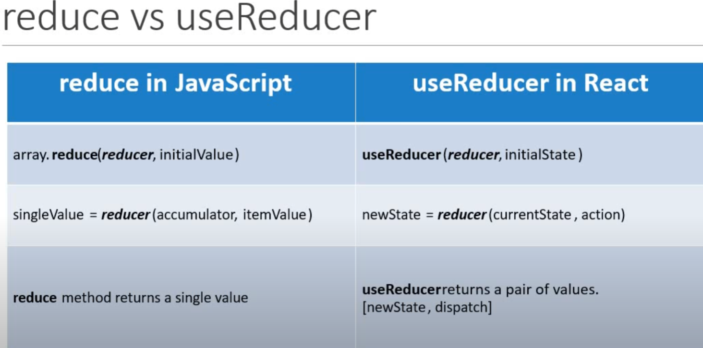

Here’s your React tutorial content converted into a Markdown file:

    ---

# React Hook Tutorial

### **45. Rules for Using React Hooks**
1. Only call hooks at the **top level**, not inside loops, conditions, or nested functions.
2. Only call hooks from **React functions**.

```jsx
const [count, setCount] = useState(0);
```

---

### **46. useState with Previous State**

Using the previous state to update `count`:

```jsx
const [count, setCount] = useState(0);

const increment = () => {
    setCount(prevCount => prevCount + 1); // Correct
    // setCount(count + 1); // Wrong: can cause stale state issues
};
```

---

### **47. useState with Object**

When using state with objects, always spread the existing state:

    ```jsx
const [name, setName] = useState({ firstName: '', lastName: '' });

setName({ ...name, firstName: 'Bruce' }); // Correct
// setName({ firstName: 'Bruce' }); // Wrong: This will overwrite the entire object
```

---

### **48. useState with Array**

Using state with an array:

    ```jsx
const [items, setItems] = useState([]);

setItems([...items, { id: items.length, value: Math.floor(Math.random() * 100) + 1 }]);
```

---

### **49. useEffect Hook**

`useEffect` lets you perform **side effects** in function components.
It replaces `componentDidMount`, `componentDidUpdate`, and `componentWillUnmount` in class components.

---

### **50. useEffect After Every Render**

`useEffect` runs after every render of the component:

    ```jsx
useEffect(() => {
    document.title = `You clicked ${count} times`;
});
```

Equivalent to:

    ```jsx
componentDidMount() {
    document.title = `You clicked ${this.state.count} times`;
}
componentDidUpdate() {
    document.title = `You clicked ${this.state.count} times`;
}
```

---

### **51. Conditionally Run Effects**

Run effects **only when specific values change**:

```jsx
useEffect(() => {
    document.title = `You clicked ${count} times`;
}, [count]); // Runs only when `count` changes
```

---

### **52. Run Effects Only Once**

Run the effect **only once** (similar to `componentDidMount`):

```jsx
useEffect(() => {
    document.title = `You clicked ${count} times`;
}, []); // Empty dependency array
```

---

### **53. useEffect with Cleanup**

`useEffect` can return a cleanup function. Example: clearing intervals:

    ```jsx
useEffect(() => {
    const interval = setInterval(() => {
        setCount(prevCount => prevCount + 1);
    }, 1000);

    return () => clearInterval(interval); // Cleanup on unmount
}, []);
```

---

### **54. useEffect with Incorrect Dependency**

This causes a bug because `count` is not in the dependency array:

    ```jsx
useEffect(() => {
    const interval = setInterval(() => {
        setCount(count + 1);
    }, 1000);
}, []); // Incorrect: `count` stays 0
```

### **Fix**: Add `count` to the dependency array:

    ```jsx
useEffect(() => {
    const interval = setInterval(() => {
        setCount(prevCount => prevCount + 1);
    }, 1000);

    return () => clearInterval(interval);
}, [count]);
```

Or use **functional updates** (recommended):

```jsx
const tick = () => {
    setCount(prevCount => prevCount + 1);
};

useEffect(() => {
    const interval = setInterval(tick, 1000);
    return () => clearInterval(interval);
}, []);
```

---

### **60. useContext Hook**

The `useContext` hook is used to consume context values created by `createContext`.

#### **In `App.js`**
```jsx
export const UserContext = React.createContext();
export const ChannelContext = React.createContext();

function App() {
    const [user, setUser] = useState(null);

    return (
        <UserContext.Provider value={user}>
            <ChannelContext.Provider value={'Codevolution'}>
                <ComponentC />
            </ChannelContext.Provider>
        </UserContext.Provider>
    );
}
```

#### **In `ComponentC.js`**
```jsx
import React, { useContext } from 'react';
import { UserContext, ChannelContext } from '../App';

function ComponentC() {
    const user = useContext(UserContext);
    const channel = useContext(ChannelContext);

    return (
        <div>
            {user} - {channel}
        </div>
    );
}
```


### **61. useReducer Hook**


```jsx
import React, {useReducer} from "react";


```


